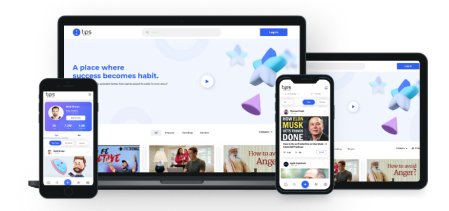

### hey there, I turn coffee into code

hi, i'm Tawhidul Islam Khan, a passionate self-taught full stack web developer.Experienced in JavaScript, TypeScript, PHP, React.JS, Vue.JS, WordPress, Laravel, SQL, GIT, SCSS, CSS,Database Design, Restful API, Software Architechture, AWS Amplify etc. A person who loves to code and is very passionate and adapt at learning new technologies.

<!--
  
   -->

## ⚡ Technologies

## My Projects

<table>
  <tbody>
  <tr>
        <td>
      

      
      <h3>Tips By Virtunus(Next)</h3>

 It's single page react application with SSR feature, it is a hybrid app, backend developed with laravel, connected to web app with REST API. 

I used technologies in web application are <b>Next.JS</b>, <b>TypeScript</b>, Service based Frontend Architechture, <b>SCSS</b>, <b>Ant Design UI Library</b>, modular scss, and many more modern technique.

<a href="https://tips.virtunus.com/" target="_blank">View</a>

</td>
 <td>
      

      
      <h3>Virtunus Auth Account App(React)</h3>

 This is user account app which is connected with many other applications like, built with React JS, TypeScript, Redux etc.

<a href="https://accounts.virtunus.com/" target="_blank">View</a>

</td>

 <td>
      

      
      <h3>Heal Single Page App (React)</h3>

 This is user account app which is connected with many other applications like, built with React JS, TypeScript, Redux etc.

<a href="https://www.heal.xyz/" target="_blank">View</a>

</td>

  </tr>
      <tr>
       <td style="display:flex; flex-direction: column">

      <h3>Loaneo (React)</h3>
      

 It's single page react application

I used technologies in web application are <b>React.JS</b>, <b>JavaScript</b>, <b>SCSS</b>, <b>Ant Design UI Library</b>.

<a href="https://loaneo.co.uk/apply?productId=234&price=345">View</a>

</td>
            <td style="display:flex; flex-direction: column">
<h3>WooCommerce Order Cancellation Email to Customer</h3>

Tik Order Cancellation Email to Customer is an extension of WooCommerce for sending order cancellation email to customer.

Technology used: <b>WooCommerce API</b>, <b>PHP</b>, <b>WordPress API</b> etc.

<a href="https://wordpress.org/plugins/tik-order-cancellation-email-to-customer/">View</a>
</td>

</tr>
      <tr>
      <td><h3>Enzaime Chat module</h3>

I developed it along with full Enzaime web app, Technology used: <b>Vue.JS</b>, <b>JavaScript</b>, <b>SCSS</b>. Backend is seperate which is developed backend team with Laravel.

<a href="https://enzaime.com/symptom-checker">View</a>
</td>
 <td><h3>LifeSpring WordPress Theme</h3>

I worked in this project for customizing theme, Tutorm LMS is used here. I customized, applied new design and overrride tutor lms templates as well as theme templates and add metaboxes and settings options on dashboard.

<a href="https://www.lifespringint.com/courses/">View</a>
</td>
 <td><h3>Stamped.io</h3>

It is Static site, I developed it with <b>Bootstrap UI</b>, <b>SCSS</b>, <b>JavaScript</b>, <b>jQuery</b> etc.

<a href="https://stamped.io/">View</a>
</td>
</tr>
      <tr>
      <td><h3>BD phone validation npm package</h3>

An npm package which checks whether the given number is valid Bangladeshi contact number or not as well as retun mobile operator name as JSON response. Written in JavaScript.

<a href="https://www.npmjs.com/package/is-valid-bd-phone">View</a>
</td>
</tr>
</tbody>
</table>
<!--END_SECTION:waka-->

## Social Links

